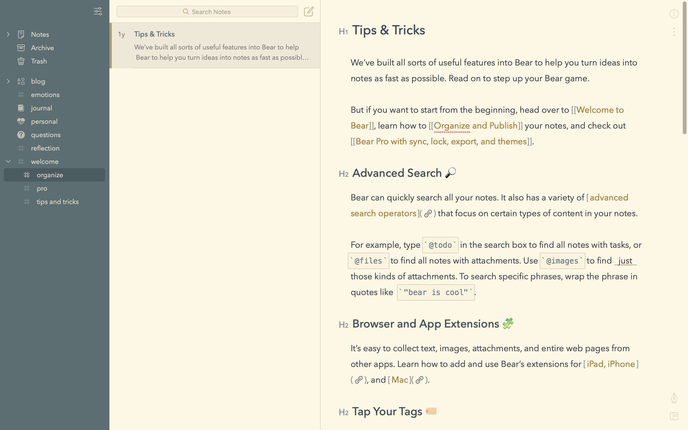
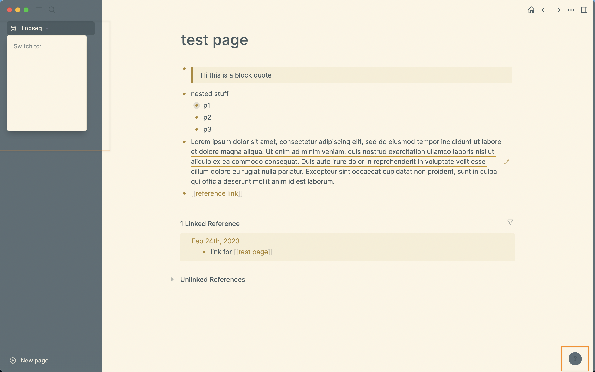
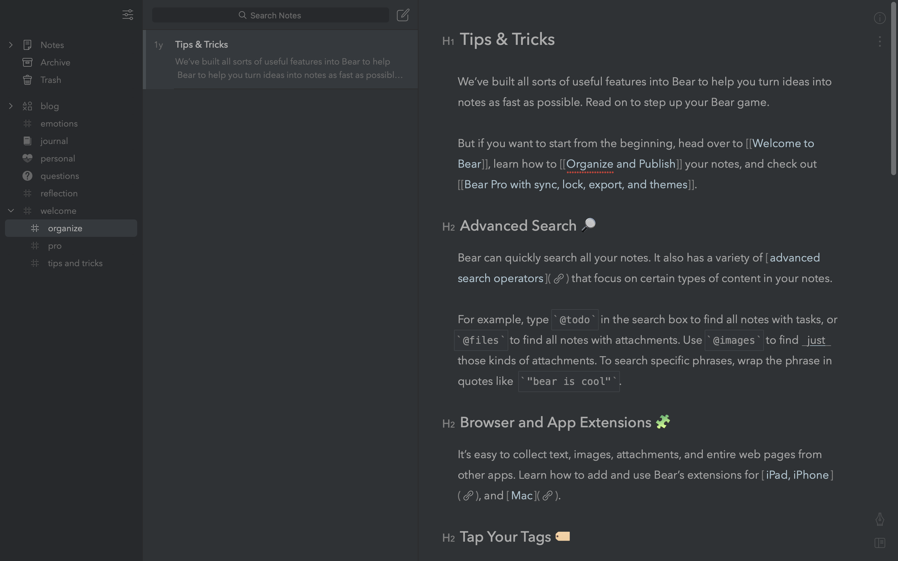
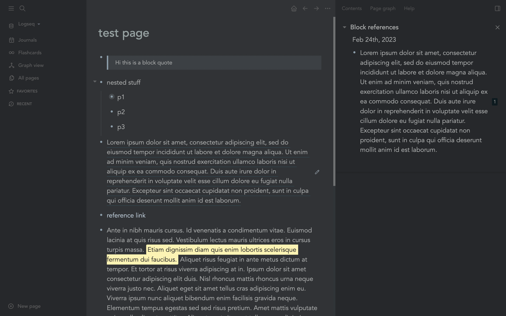
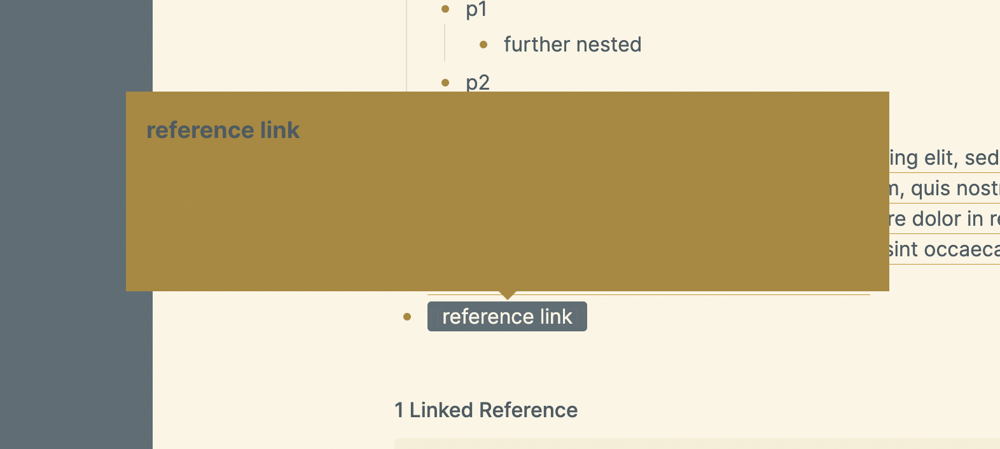
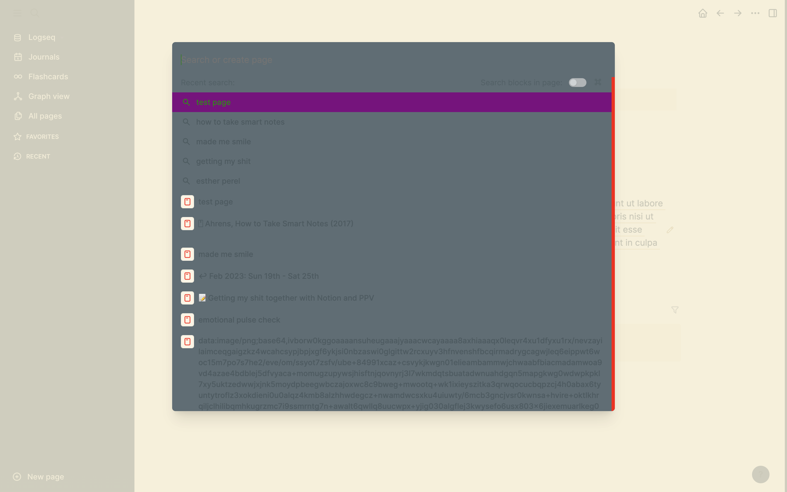
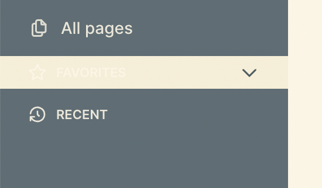
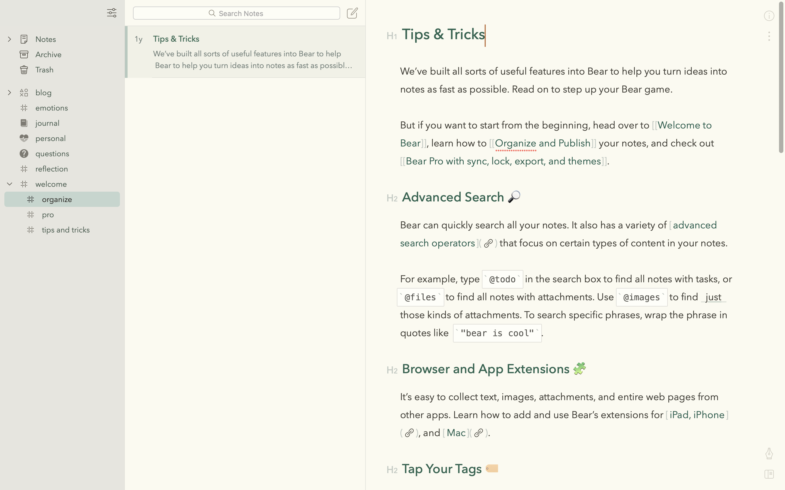

# logseq themes

inspired by rcvd's original bear theme:  https://rcvd.github.io/logseq-bear-theme/

but focussing on reproducing my own favourite themes from Bear Pro (Solarized Light and Charcoal)

bulk of code that i modified was derived from this page: https://docs.logseq.com/#/all-pages

## original light theme view in Bear 

### Solarized Light

### logseq solarized theme so far

## dark theme

### original charcoal theme viewed in Bear

### logseq charcoal theme so far

- minor colours still off (code inline and code colours)
- the menu font colour for settings is too light, it uses the same colour as the other menu links 

### problems
- naming convention in a original code is a bit confusing - find better naming convention 
- set up a more efficient testing environment
- not sure how to make folders in github. i made a new repo on the site, then cloned a copy on github desktop, added folders directly to the cloned directly but when i pushed the changes, it stalled and wouldn't upload so i had to commit directly on github ...
- sidebar and blockquote font should be bigger than main text font 
- any favourited or recent pages should be indented to show clear folder structure
- unable to target:
    - reference links
        - hover makes background blue ... seems to be dependent on something else in the code that isn't visible in dev tools
        - get rid of auto brackets around reference links
        - preview of reference link is automatically set to incorrect colour making for uncomfortable reading
        
    - dialogue pop up box in solarized theme for search function, settings etc. seems to be automatically set to `--ls-secondary-background-color`
    
    - the hover background over the expanding sidebar menu "favourites" and "recent" in solarized theme is hard to read
    

## what I've learnt

first time i've tried to read and build on someone else's code

## to attempt in future 

would be cool to change logseq icon depending on theme used the way that Bear changes background :) 

### Olive Dunk

a brighter, fresher look than solarized 

